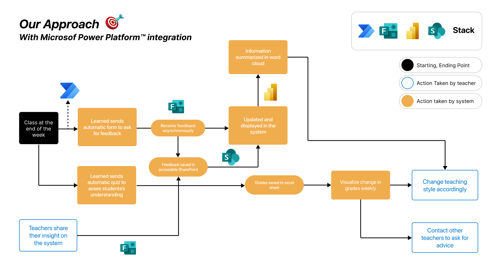
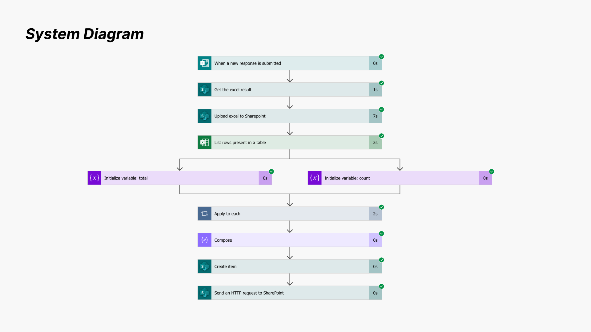

# Learned by ÜNCAA
Learned is a Microsoft Power Platform-based application to help teachers collaborate and personalize their lectures to students' needs.

## Background and Motivation
Despite the amount of classroom management applications in the market, only a few are focused on collaborative evaluation among teachers and building an inclusive learning environment for all students. Adding more sophisticated features usually require considerable coding skills, so many teachers without a strong technical background are struggling to meet their teaching preferences. By leveraging the features of Microsoft Power Platform, we present Learned, a low-code classroom management application that allows teachers to:
1. Understand their students' strengths and weaknesses by combining observations from other teachers
2. Streamline their assignment, grading, and feedback process, with appropriate automation for better efficiency
3. Get a big picture of students' impression to classes, helping them adjust to their students' preferences and find specific points to improve

## System Diagram Overview

Our system is backed by:
1. Microsoft Power Apps --> for low-code, secure, easy-to-maintain classroom management application
2. Microsoft Power Automate --> for efficient automated flow with specific triggers
3. Microsoft Power BI --> for word cloud generation from teachers' notes
4. Microsoft SharePoint --> for data storage and update
5. Microsoft Forms --> for giving out assignments and requesting feedback

Microsoft Power Automate allows us to automate the update of lists stored in SharePoint.

## (Important) How to Run the Application
1. Head over to our [Power Apps link]() and login using the appropriate credentials.
2. The 'Dashboard' tab is where you, as a teacher, can see the list of students in your class with compiled notes from various teachers. On the right side, a word cloud is provided to help you understand popular observation trends.
3. You can click on the 'Add Note' button to generate a new note. The database in SharePoint will be updated automatically.
4. If you switch to the 'Teachers List' tab, you can see the list of teachers, the subject they are teaching, and their teaching hours.
5. If you switch to the 'Feedback' tab, you can see the responses to the Forms feedback form from students.

To update the word cloud,
1. While the SharePoint database can be updated real-time, the Power BI dataset needs to be refreshed manually. Head over to the [Power BI link](https://app.powerbi.com/groups/me/list?redirectedFromSignup=1) and login using the appropriate credentials.
2. Click on the 'WordCloud' dataset and press 'Refresh' to refresh the data after updates to the SharePoint dataset are made. After refreshing, the word cloud will be automatically updated.
3. Automatic updates to the Power BI dataset are available daily, but real-time updates can currently only be done manually using the steps above.

To modify the lists directly,
1. Head over to the [SharePoint Microsoft Lists link](https://kaistackr-my.sharepoint.com/personal/adeeb_islam8_kaist_ac_kr/_layouts/15/lists.aspx) and login using the appropriate credentials.
2. Navigate to 'Teacher List' to update the list of teachers and 'Comment' to update students' observation notes.
